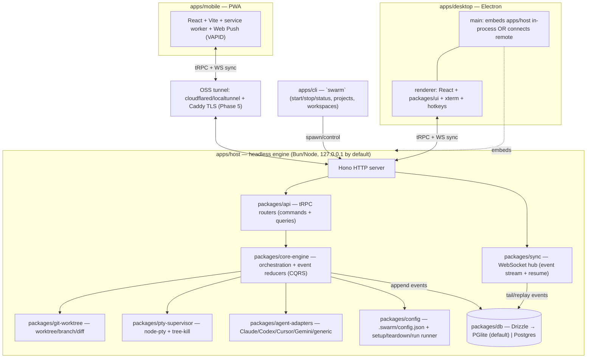

# architecture.md — SWARM Target Architecture

> Our 1:1, cross-platform, OSS replica of Superset. Codename **SWARM**. This doc is binding
> for every later phase; it must not contradict `DECISIONS.md` (ADR-0001..0009) or `PARITY.md`
> (P01–P14). For what the original does, see `docs/recon.md`.

## 0. Thesis

The original is macOS-first Electron + Neon(cloud Postgres) + ElectricSQL + Docker + a hosted
relay, with a React Native mobile app. We keep the **product** (parallel CLI agents in
isolated worktrees, terminal, diff/edit, presets, monitoring, client/host sync) and swap the
**substrate** for a Windows-first, zero-Docker, OSS, self-hosted stack:

- **One headless host engine** (`apps/host`) owns all stateful, OS-touching work (git
  worktrees, PTYs, process trees, the event log). It runs standalone (CLI/daemon) and is also
  embedded in the Electron main process. Clients (desktop renderer, mobile PWA) are **thin**
  and reach the engine only over tRPC + a WebSocket sync channel.
- **PGlite** (embedded Postgres/WASM) via **Drizzle** is the single source of truth; the same
  schema runs against a real Postgres when one is present (ADR-0003).
- **Sync** is our own append-only **event log + resume tokens over WebSocket** (no Electric,
  no Neon, no Docker).

## 1. Component diagram



Key property: **the host is the only writer.** Clients issue commands (tRPC mutations); the
engine validates, mutates git/PTY/fs, **appends events**, and broadcasts them. Every client
materializes identical state by folding the same event stream. This is CQRS + event-sourcing,
so there are no client-side write conflicts and reconnect is just "replay from my cursor."

## 2. Monorepo topology (Turborepo + Bun; ADR-0004/0008)

**`apps/`**
| App | Role | Lands |
|---|---|---|
| `apps/host` | Headless engine daemon: Hono + tRPC + WS + PGlite. Runs standalone or embedded in Electron main. The home of all OS-touching code. | Phase 2 |
| `apps/desktop` | Electron shell (`main`, `preload`, `renderer`). Embeds `apps/host` in-process for local use; can instead connect to a remote host. | Phase 3 |
| `apps/mobile` | PWA (React + Vite, service worker, Web Push). Thin client over sync; installable, offline-first. | Phase 4 |
| `apps/cli` | `swarm` CLI: `start --daemon` / `status` / `stop`, `projects`, `workspaces`, `auth`. Self-bootstrap + phone-only setup entrypoint. | Phase 2 (core) / 5 (remote) |
| `apps/docs` | MDX docs site (parity with original's docs surface). | Phase 6 |

**`packages/`**
| Package | Responsibility |
|---|---|
| `packages/core-engine` | Platform-agnostic orchestration: workspace lifecycle, agent-run state machine, event definitions + reducers, status/idle derivation. No Node-native deps. |
| `packages/git-worktree` | Create/list/remove/import worktrees, branch + base-branch resolution, status + diff computation, file read/write for inline edits. |
| `packages/pty-supervisor` | `node-pty` spawn/IO/resize, PTY session registry, scrollback ring buffer + serialize checkpoints, `tree-kill` termination. Runs as a child process so a native crash never takes down Electron main. |
| `packages/agent-adapters` | Adapter descriptors (Claude Code, OpenAI Codex CLI, Cursor Agent, Gemini CLI, + generic "any CLI"). Command/arg templates, prompt injection, model overrides, idle/"needs-attention" heuristics. Generic adapter = zero-config terminal command. |
| `packages/api` | tRPC routers (the contract in §3) + Hono adapter. Exports router **types** consumed by every client for end-to-end type safety. |
| `packages/db` | Drizzle schema + migrations (drizzle-kit). `DATABASE_URL` selects PGlite (`file://./.data/pg`, default) or real Postgres. |
| `packages/sync` | WebSocket protocol (frames, resume tokens), server broadcaster (event tail), client sync engine (catch-up replay → live tail → reducer apply into a local PGlite/IndexedDB cache). |
| `packages/ui` | Shared React components (Tailwind, Lucide/Phosphor, Fontsource) used by desktop renderer + mobile PWA. Empty/loading/error states, dense dev-tool aesthetic. |
| `packages/terminal` | `xterm.js` wrapper + addons (fit, search, web-links, serialize, unicode11, ConPTY-aware), shared desktop+mobile. |
| `packages/config` | `.swarm/config.json` zod schema (`setup`/`teardown`/`run`, `before`/`after` overlay), env-var injection (`SWARM_ROOT_PATH`, `SWARM_WORKSPACE_NAME`, `SWARM_WORKSPACE_PATH`), and the cross-platform command runner (TS, no `.sh`). |
| `packages/shared` | Ids, branded types, `Result`, constants, **path normalization + EOL** helpers (the cross-platform discipline of §5). |
| `tooling/*` | Shared `tsconfig`, Biome config, Turbo pipeline. |

Naming note: the original's `host-service` + `pty-daemon` + `workspace-fs` map onto our
`core-engine` + `pty-supervisor` + `git-worktree`; `macos-process-metrics` is replaced by a
cross-platform metric source (e.g. `pidusage`) inside `pty-supervisor`.

## 3. API / data-model contracts

### 3.1 tRPC router surface (`packages/api`)

Mutations are **commands** (they append events); queries read materialized state;
subscriptions ride the sync channel. Shapes below are illustrative TS, enforced by zod.

```ts
// router: projects
projects.list()                         -> Project[]
projects.create({ name, repoUrl?, localPath?, clone?: boolean }) -> Project
projects.get({ projectId })             -> Project
projects.remove({ projectId })          -> { ok: true }

// router: workspaces
workspaces.list({ projectId? })         -> Workspace[]
workspaces.create({ projectId, name, branch, baseBranch?, runSetup?: boolean }) -> Workspace
workspaces.get({ workspaceId })         -> Workspace
workspaces.remove({ workspaceId, deleteBranch?: boolean }) -> { ok: true }
workspaces.rename({ workspaceId, name }) -> Workspace
workspaces.openExternal({ workspaceId, target: "vscode"|"cursor"|"terminal"|"folder" }) -> { ok: true }
workspaces.importExternal({ projectId }) -> Workspace[]
workspaces.onStatus()                   -> sub<WorkspaceStatus>   // {workspaceId, status, lastActivityAt}

// router: agents
agents.listAdapters()                   -> AdapterDescriptor[]    // built-ins + generic
agents.listPresets()                    -> AgentPreset[]
agents.upsertPreset(AgentPresetInput)   -> AgentPreset
agents.start({ workspaceId, presetId, prompt? }) -> Session
agents.stop({ sessionId })              -> { ok: true }

// router: sessions
sessions.list({ workspaceId })          -> Session[]
sessions.onActivity({ workspaceId })    -> sub<SessionActivity>

// router: terminal  (high-frequency IO over an ephemeral WS topic, not the durable log)
terminal.listShells()                   -> ShellDescriptor[]      // pwsh, powershell, cmd, git-bash, wsl, bash, zsh...
terminal.create({ workspaceId, shell?, cwd?, cols, rows }) -> { ptyId }
terminal.write({ ptyId, data })         -> void
terminal.resize({ ptyId, cols, rows })  -> void
terminal.kill({ ptyId })                -> void                   // tree-kill
terminal.onData({ ptyId })              -> sub<string>            // ephemeral stream

// router: diffs
diffs.status({ workspaceId })           -> FileChange[]           // {path, changeType, additions, deletions}
diffs.getFileDiff({ workspaceId, path }) -> { hunks: Hunk[], oldText, newText }
diffs.writeFile({ workspaceId, path, content }) -> { ok: true }   // inline edit
diffs.discard({ workspaceId, path? })   -> { ok: true }

// router: presets  (terminal/command presets, Ctrl+1-9)
presets.list({ projectId? })            -> CommandPreset[]
presets.run({ workspaceId, slot })      -> { ptyId }

// router: config
config.read({ projectId })              -> SwarmConfig
config.runSetup({ workspaceId })        -> { ptyId }
config.runTeardown({ workspaceId })     -> { ok: true }
config.runRun({ workspaceId })          -> { ptyId }

// router: ports
ports.scan({ workspaceId })             -> Port[]                 // {port, pid, process, protocol}
ports.onPorts({ workspaceId })          -> sub<Port[]>

// router: notifications
notifications.list({ unreadOnly? })     -> Notification[]
notifications.markRead({ id })          -> { ok: true }
notifications.subscribePush({ subscription }) -> { ok: true }     // Web Push / VAPID

// router: settings
settings.getHotkeys()                   -> HotkeyBinding[]        // per-OS defaults + overrides
settings.setHotkey({ actionId, binding }) -> HotkeyBinding
settings.exportHotkeys() / importHotkeys({ json })
settings.getAgents() / setAgent(...)

// router: host  (client<->host handshake, presence)
host.status()                           -> { hostId, version, os, online, boundTo }
host.info()                             -> HostInfo
host.connect({ token })                 -> { ok: true, resumeToken }

// router: auth
auth.session()                          -> Session | null
auth.loginGitHub() / auth.logout()      // reuses gh / GH_TOKEN like the original
```

### 3.2 Drizzle / Postgres schema (`packages/db`)

```
projects(id pk, name, repo_url?, local_path?, default_branch, created_at)
workspaces(id pk, project_id fk, name, branch, base_branch, worktree_path,
           status enum[idle|running|needs_attention|error|done],
           created_at, last_activity_at)
agent_presets(id pk, name, adapter_id, command, args jsonb, prompt_template?,
              model?, env jsonb, icon?, enabled bool)
sessions(id pk, workspace_id fk, preset_id fk?, adapter_id,
         mode enum[terminal|chat], pid?, status, exit_code?, started_at, ended_at?)
events(seq bigserial pk, host_id, workspace_id?, session_id?, type,
       payload jsonb, actor, created_at)            -- APPEND-ONLY; sync backbone
file_changes(id pk, workspace_id fk, path, change_type enum[added|modified|deleted|renamed],
             additions int, deletions int, computed_at)   -- materialized from git status
command_presets(id pk, project_id fk?, slot int 1..9, label, command, shell?)
ports(id pk, workspace_id fk, port int, pid?, process?, protocol, opened_at)
notifications(id pk, workspace_id fk?, kind, title, body, read bool, created_at)
hosts(id pk, device_name, os, endpoint, online bool, last_seen_at, owner)
push_subscriptions(id pk, endpoint, keys jsonb, created_at)
hotkey_overrides(id pk, action_id, binding, os_scope)
sync_cursors(client_id pk, last_seq bigint, updated_at)    -- per-client resume high-water mark
```

`events` is the spine: `seq` is a single monotonic sequence per host. All other "live" tables
(`workspaces.status`, `file_changes`, `ports`, `sessions`) are **projections** the engine
maintains as it appends events, so a fresh client can rebuild them purely by folding the log.

## 4. Sync protocol (`packages/sync`)

**Goal:** real-time multi-client state with correct **reconnect/resume**, over a single
WebSocket, backed by the PGlite append-only `events` log. No CRDT (single-writer host).

**Resume token.** Opaque `base64({ hostId, seq, v })` where `seq` is the highest event the
client has durably applied. Clients persist it (localStorage/PGlite); it is the only state a
client needs to resume.

**Connect / catch-up / tail.**
1. Client opens `wss://…/sync` and sends `HELLO { resumeToken? , topics: [...] }`.
2. Server validates the token's `hostId` (mismatch ⇒ `RESET` ⇒ client drops its cache and
   re-snapshots from `seq=0`).
3. **Catch-up:** server streams `BATCH { events: [...] }` for `seq > token.seq`, chunked,
   ordered by `seq`. Client folds each event through `core-engine` reducers and advances its
   cursor.
4. **Live tail:** once caught up, server sends `CAUGHT_UP { seq }` then pushes `EVENT { … }`
   as new events are appended. On real Postgres this rides `LISTEN/NOTIFY`; on PGlite it
   rides an in-process emitter the writer fires after each append.
5. Client periodically sends `ACK { seq }`; server records it in `sync_cursors`.

**Frames:** `HELLO`, `BATCH`, `EVENT`, `CAUGHT_UP`, `ACK`, `PING`/`PONG` (heartbeat,
~15s), `RESET`, `ERROR { code }`.

**Reconnect.** On socket drop the client reconnects with its last token and repeats catch-up
from exactly where it left off. Because apply is **idempotent by `seq`** (and events are
immutable), replays are safe; a duplicated batch is a no-op. Heartbeat + exponential backoff
(jittered) detect dead sockets; the engine keeps appending while clients are away.

**Terminal data is out-of-band.** Per-keystroke PTY output would bloat the durable log, so it
streams on an **ephemeral** WS topic keyed by `ptyId` (and `terminal.onData`). Durability for
terminals comes from the PTY scrollback ring buffer plus periodic **serialize checkpoint
events** (`terminal.checkpoint`) in the log — enough to restore a reattached session, matching
the original's "closing the laptop doesn't kill the session" property (the session lives on
the host, not the client).

**Backpressure & safety.** Catch-up is chunked and ack-gated; a client lagging beyond a
window is sent `RESET` to force a clean re-snapshot rather than unbounded buffering. Local
host binds `127.0.0.1`; remote exposure is explicit and tunneled (Phase 5, ADR-0009),
satisfying **P11 private-by-default**.

## 5. Cross-platform notes (Windows-first; ADR-0002/0007)

- **PTYs — node-pty / ConPTY.** Windows 10 ≥1809 uses ConPTY; we keep a winpty fallback path
  for older builds. **RISK (ADR-0007):** Node 24 prebuilds for `node-pty` may be missing —
  Phase 2 opens with a load-validation gate; fallbacks are `@homebridge/node-pty-prebuilt-multiarch`
  or pinning the engine to Node 22 LTS. PTYs live in the `pty-supervisor` **child process** so
  a native-module fault can't crash Electron main or the headless daemon.
- **Process-tree kill.** `tree-kill` ⇒ `taskkill /T /F /PID <pid>` on Windows (no POSIX
  process groups / no SIGTERM tree semantics); signal-tree (`SIGTERM`→`SIGKILL`) on
  macOS/Linux. Agents spawn grandchildren (node, python, package managers); we always kill the
  **whole tree** by root PID, never a bare `process.kill`.
- **Paths.** All path math via `node:path`; **store POSIX-normalized paths** in the DB and
  convert only at the OS boundary. Handle drive letters + UNC; enable Windows **long paths**
  (`\\?\` prefix and `git config core.longpaths true`) because deep worktree + node_modules
  trees blow past 260 chars.
- **Windows shells in the terminal.** `terminal.listShells()` detects and offers **PowerShell 7
  (`pwsh`)**, **Windows PowerShell**, **cmd.exe**, **Git Bash (`bash.exe`)**, and **WSL
  (`wsl.exe -d <distro>`)**, plus `bash`/`zsh` on Unix. Preset and `run` commands execute on
  the user-selected shell; quoting/escaping is shell-aware.
- **EOL.** Normalize stored file content + diffs to **LF**; respect `.gitattributes` and
  `core.autocrlf`; xterm renders CRLF correctly. Per ADR-0004 all setup/teardown/run scripts
  are **TypeScript run via Bun/Node**, never `.sh`, so there are no CRLF-shebang or
  bash-only failures on Windows user paths.
- **Defaults & hotkeys.** We ship per-OS default bindings; on Windows we follow the original's
  own remapping discipline (`⌘`→`Ctrl+Shift+…`) to avoid clobbering terminal control codes,
  while keeping `Ctrl+1–9` for presets (P05).
- **CI.** `windows-latest` + `macos-latest` + `ubuntu-latest` matrix from Phase 0; a red OR
  skipped Windows job = not done (RUBRIC §6.1, P14).

## 6. PARITY mapping (P01–P14 → owner → phase)

| ID | Parity item | Primary package(s) / app | Phase |
|----|-------------|--------------------------|-------|
| P01 | Parallel execution | `core-engine` + `pty-supervisor` + `apps/host` | 2 |
| P02 | Worktree isolation | `git-worktree` + `core-engine` | 2 |
| P03 | Agent adapters (Claude/Codex/Cursor/Gemini/generic) | `agent-adapters` | 2 |
| P04 | Monitoring & notifications | `core-engine` (status) + `sync` + `ui`; Web Push in `apps/mobile` | 2 (status) / 4 (push) |
| P05 | Built-in terminal (tabs, splits, clear, find, presets Ctrl+1–9, prev/next) | `pty-supervisor` + `terminal` + `packages/panes`-equiv in `ui` | 2 (engine) / 3 (UI) |
| P06 | Diff viewer + inline editor | `git-worktree` (diff/write) + `ui` + `apps/desktop` | 3 |
| P07 | Workspace presets (`.swarm/config.json` setup/teardown/run) | `config` + `core-engine` | 2 (engine) / 3 (UI) |
| P08 | Open-in-external (IDE/terminal/folder) | `apps/desktop` (+ `apps/host` resolver) | 3 |
| P09 | Workspace navigation + customizable shortcuts + settings | `ui` + `apps/desktop` hotkey registry + `settings` router | 3 |
| P10 | Client/host + real-time sync (self-hosted) | `sync` + `api` + `db` + `apps/host` | 2 (local) / 5 (remote) |
| P11 | Private by default (explicit connections only) | `apps/host` (127.0.0.1 bind) + `sync` + `auth` | 2 / 5 |
| P12 | Mobile-native control | `apps/mobile` (PWA) + `sync` + `ui` | 4 |
| P13 | Self-bootstrap + phone-only remote setup | `apps/cli` + `apps/host` + tunnel (cloudflared/Caddy) | 5 |
| P14 | Native Win/macOS/Linux (terminal shells, tree-kill, paths, EOL, CI) | `pty-supervisor` + `git-worktree` + `config` + `shared` + CI | 2→ (proven 6) |

## 7. Top architecture risks

1. **`node-pty` on Node 24 / Windows ConPTY (ADR-0007).** Highest-severity: the whole product
   is dead without working PTYs on Windows. Mitigation: Phase 2 validation gate + documented
   fallbacks (prebuilt-multiarch or Node 22 LTS pin). Isolated in a crashable child process.
2. **PGlite as the sync backbone at scale.** PGlite is single-process WASM Postgres; our event
   tail relies on an in-process emitter rather than real `LISTEN/NOTIFY`, and many concurrent
   agents writing high event volume could pressure it. Mitigation: keep terminal IO out of the
   durable log; chunk + ack catch-up; the Drizzle schema is portable to real Postgres for
   heavy/remote deployments without code change.
3. **PWA reaching true native-feel + reliable push (P12/P04).** Web Push on iOS is constrained
   (installed-PWA only, no background pull), gestures/60fps and offline-first take real craft,
   and the relay/tunnel path (Phase 5) adds latency. Mitigation: PWA-first now with Capacitor
   held in reserve (ADR-0006); design the sync client for lossy mobile links from day one.

## 8. Files written this phase

- `docs/recon.md` — faithful description of the original (features, exact shortcuts incl.
  Windows bindings, config schema, package layout, client/host + sync mechanisms, sources).
- `docs/architecture.md` — this document.
